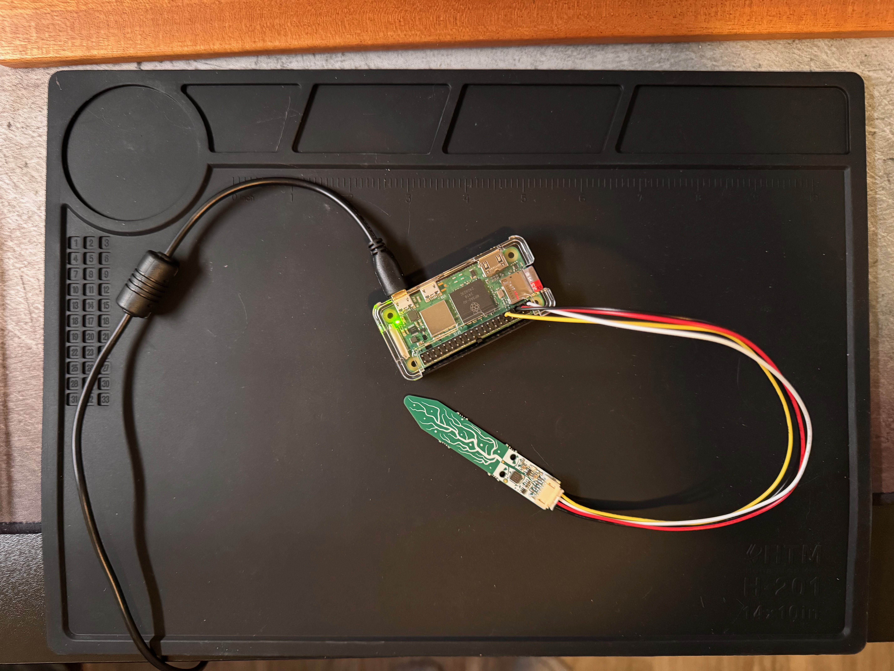

# rpi-plant-moisture

[](https://github.com/cmackenzie1/rpi-plant-moisture/actions/workflows/rust.yml)

A simple rust program to read the moisture level of a plant using a capacitive moisture sensor and a Raspberry Pi via I2C.

If you haven't already, you'll need to enable I2C on your Raspberry Pi. You can do this by running `sudo raspi-config` and enabling I2C in the interfaces section. You'll also need to install the `i2c-tools` package by running `sudo apt install i2c-tools` to use the `i2cdetect` command.

Most of the code is based on the CircuitPython Seesaw library for the STEMMA Soil Sensor. You can find the original code [here](https://github.com/adafruit/Adafruit_CircuitPython_seesaw).



## Hardware

- [Raspberry Pi Zero W 2](https://www.adafruit.com/product/5291)
- [Adafruit STEMMA Soil Sensor - I2C Capacitive Moisture Sensor](https://www.adafruit.com/product/4026)

## Usage

```bash
# Run the program using cargo (assuming you are on the Raspberry Pi)
cargo run

# or if you want to compile the binary elsewhere and run it on the Raspberry Pi
# install the target for the Raspberry Pi Zero W 2 (aarch64)
rustup target add aarch64-unknown-linux-gnu
cargo build --release --target aarch64-unknown-linux-gnu
# copy the binary to the Raspberry Pi
scp target/aarch64-unknown-linux-gnu/release/rpi-plant-moisture <username>@<ip>:~/rpi-plant-moisture
# run the binary on the Raspberry Pi via SSH
./rpi-plant-moisture

# Example output
Starting soil sensor readings...
Temperature: 25.68°C
Moisture: 350 (200 - 2000)
---
Temperature: 24.94°C
Moisture: 352 (200 - 2000)
---
Temperature: 25.15°C
Moisture: 351 (200 - 2000)
```
